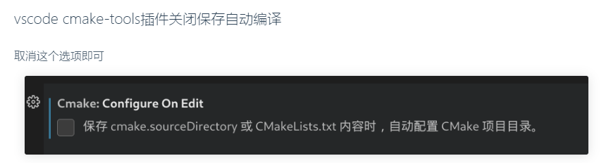

# cmakeNote

## (1)<font color=#FFE4B5>cmake_commander</font>

  * cmake编译target

    ```
    cmake -S . -B build
    ```

    

## (2)<font color=#FFE4B5>cmake_target</font>

  * 定义一个可以构建成可执行程序的target

    ```
    add_executable(<name> [win32] [MACOSX_BUNDLE] [EXCLUDE_FROM_ALL] [source1] [source2...])
    "<>": 必填
    "[]": 选填
    win32: windows平台特定参数
    MACOSX_BUNDLE: apple平台特定参数
    EXCLUDE_FROM_ALL: 若存在，cmake默认构建的时候不会构建这个target
    source1: 构建该执行函数所需的源码

    e.g
    cmake_minimum_required(VERSION 3.26 FATAL_ERROR)
    add_executable(main main.cpp)
    ```

  * 定义构建库文件的target

    ```
    add_library(<name> [STATIC | SHARED | MODULE] [EXCLUDE_FROM_ALL] [<source>...])
    STATIC: 静态库
    SHARED: 动态库
    MODULE: 类似于动态库，不过不会被其他库或者可执行程序链接，用于插件式框架的软件构建

    最佳实践是不要自己在 CMakeLists.txt 中指定这几个参数，
    而是把主动权交给构建者，
    通过 cmake -DBUILD_SHARED_LIBS=YES 的形式传值告诉其需要构建哪种库

    e.g
    cmake_minimum_required(VERSION 3.26 FATAL_ERROR)
    add_library(study)

    # [目标源码]
    target_sources(study
        PRIVATE
        add.cpp
    )

    # [寻找头文件在指定路径中，防止使用了与系统同名的头文件，链接异常头文件]
    target_include_directories(study
        PUBLIC
        ${CMAKE_CURRENT_BINARY_DIR}
        ${CMAKE_CURRENT_LIST_DIR}/include
    )
    ```

  * 用户自定义构建target

    ```
    add_custom_target(Name [ALL] [command1 [args1...]]
    [COMMAND command2 [args2...] ...]
    [DEPENDS depend depend depend ... ]
    [BYPRODUCTS [files...]]
    [WORKING_DIRECTORY dir]
    [COMMENT comment]
    [JOB_POOL job_pool]
    [VERBATIM] [USES_TERMINAL]
    [COMMAND_EXPAND_LISTS]
    [SOURCES src1 [src2...]]
    )

    CMake 高级用法中才会涉及的命令
    ```

  * 关于target链接

    ```
    Target 之间在构建的时候可能会出现 A 依赖 B，B 依赖 C 等情况。
    一般这种依赖都是因为某个 Target 需要链接另一个 Target

    target_link_libraries(targetName
    <PRIVATE|PUBLIC|INTERFACE> item1 [item2 ...]
    [<PRIVATE|PUBLIC|INTERFACE> item3 [item4 ...]]
    ...
    )

    targetName: 链接的目标名字。该名字必须是一个由 add_executable() 或者 add_library() 命令创建的 Target 的名字
    PRIVATE: 这些库只有 targetName 这个 Target 本身需要，其他任何链接 targetName 这个 Target 的其他 Target 都不知道这些 iterms 的存在
    PUBLIC: 不止 targetName 本身这个 Target 需要这些 iterms，其他链接到 targetName 的 Target 也需要依赖这些 iterms，并链接这些 iterms
    INTERFACE: targetName 本身不需要这些 iterms，但是其他链接 targetName 的 Target 需要依赖这些 iterms，并链接这些 iterms

    e.g
    cmake_minimum_required(VERSION 3.26 FATAL_ERROR)
    add_subdirectory(study)

    add_executable(main)
    target_sources(main
        PRIVATE
            main.cpp
    )

    target_link_libraries(main
        PRIVATE
            study
            nlohmann_json::nlohmann_json
    )
    ```

  * 最佳实践

    ```
    1、不要将 Target 的名字设置为 ${projectName}
    2、给库命名的时候避免 lib 前缀[默认自动会添加]
    3、如果没有足够的理由，在定义库目标的时候，不要使用 STATIC 或者 SHARED 关4、键字，控制权应该交给构建时的开发者（BUILD_SHARED_LIBS）
    5、target_link_libraries() 总是指明 PRIVATE、PUBLIC 、INTERFACE
    ```

  ## (3)<font color=#FFE4B5>cmake_base</font>

  * CMake 变量的约定
    * CMake 将所有的变量的值视为字符串当给出变量的值不包含空格的时候，可以不使用引号，但建议都加上引号，不然一些奇怪的问题很难调试。
    * CMake 使用空格或者分号作为字符串的分隔符 CMake 中想要获取变量的值，和 shell 脚本一样，采用 ${var} 形式。
    * 使用 CMake 变量前，不需要这个变量已经定义了，如果使用了未定义的变量，那么它的值是一个空字符串。
    * 默认情况下使用未定义的变量不会有警告信息，但是可以通过 cmake 的 -warn-uninitialized 选项启用警告信息。
    * 使用未定义的变量非常常见，如果出现问题也不一定是因为变量未定义导致的，所以 cmake 的 -warn-uninitialized 选项用处很有限。
    * 变量的值可以包含换行，也可以包含引号，不过需要转义。

  * cmake变量之普通变量

    ```
    set(varName value... [PARENT_SCOPE])
    varName: 代表要定义的变量的变量名
    value: 定义的变量的值，根据上述 CMake 变量的约定，我们知道这里的 value 应该是一个字符串，而且不管有没有空格，都建议用引号引起来
    当然第二个参数可以是一个以空格或者分号隔开的字符串，这样定义的变量将是一个列表
    只需要记住，value 只使用没有空格或者分号分割的单个字符串即可
    PARENT_SCOPE: 可选参数，意思是定义的这个变量的作用域属于父作用域

    e.g
    set(CPR_TOP_DIR "/root/workspace/code/cpr")

    set(CPR_BASE_SOURCE "a.cpp;b.cpp")

    set(CPR_CORE_SOURCE core1.cpp core2.cpp)

    set(CPR_BUILD_CMD [[
    #!/bin/bash

    cmake -S . -B build
    cmake --build build
    ]])

    set(shellScript [=[
    #!/bin/bash
    [[ -n "${USER}" ]] && echo "Have USER"
    ]=])

    # [取消变量]
    set(myVar)
    unset(myVar)
    ```

  * cmake变量之环境变量

    ```
    set(ENV{PATH} "$ENV{PATH}:/opt/myDir")
    # [打印消息]
    message(STATUS "PATH=$ENV{PATH}")
    ```

  * cmake变量之缓存变量

    ```
    与普通变量不同，缓存变量的值可以缓存到 CMakeCache.txt 文件中，当再次运行 cmake 时，可以从中获取上一次的值，而不是重新去评估。
    所以缓存变量的作用域是全局的

    set(varName value... CACHE type "docstring" [FORCE])
    varName: 变量的名字
    value: 变量的值
    CACHE: 缓存变量不同于普通变量是从第三个参数开始的，第三个参数是固定 CACHE 这个关键字，表示这条命令定义的是缓存变量
    type: 是必选参数，而且其值必须是下列值之一
    (1)BOOL
    BOOL 类型的变量值如果是 ON、TRUE、1 则被评估为真，如果是 OFF、FALSE、0 则被评估为假。
    当然除了上面列出的值还有其他值，但是判断真假就没那么清晰了，所以建议定义 BOOL 类型的缓存变量的时候，其值就采用上述列出的值。虽然不区分大小写，但是我建议统一使用大写。
    (2)FILEPATH
    文件路径
    (3)STRING
    字符串
    (4)INTERNAL
    内部缓存变量不会对用户可见，一般是项目为了缓存某种内部信息时才使用，cmake图形化界面工具也对其不可见。内部缓存变量默认是 FORCE 的
    (5)FORCE
    关键字代表每次运行都强制更新缓存变量的值，如果没有该关键字，当再次运行 cmake 的时候，cmake 将使用 CMakeCache.txt 文件中缓存的值，而不是重新进行评估

    CMake 自身是将所有变量的值均视为字符串的
    "docstring": 一个说明性的字符串，可以为空，只在图形化 cmake 界面会展示

    由于 BOOL 类型的变量使用频率非常高，CMake 为其单独提供了一条命令
    option(optVar helpString [initialValue])
    optVar: 变量的名字
    helpString: 提供帮助信息的字符串，可以为空字符串
    initialValue: 是可选参数，代表缓存变量的值，如果没有提供，那该缓存变量的值默认为 OFF
    等价:
    set(optVar initialValue CACHE BOOL helpString)
    上述两个命令定义缓存变量是有一点点区别的，option() 命令没有 FORCE 关键字
    ```

  * cmake变量作用域

    ```
    在 C/C++ 中，我们可以使用 {}、函数、类等产生新的作用域，同时也有全局作用域的概念。在 CMake 中，通常只有在使用 add_subdirectory() 命令或者定义函数的时候产生新的作用域
    自 CMake 3.25 开始，可以使用 block() 在任意位置产生新的作用域
    在定义 CMake 普通变量的时候，如果没有 PARENT_SCOPE 选项，那该变量的作用域就在当前的 CMakeLists.txt 中或者在当前的函数，或者当前的 block() 中

    block([SCOPE_FOR [VARIABLES] [POLICIES]] [PROPAGATE var...])
    endblock()
    该命令需要 cmake >= 3.25 版本
    该命令用于创建新的作用域（变量作用域、策略作用域）

    e.g
    set(x 1)

    block()
        set(x 2)   # Shadows outer "x"
        set(y 3)   # Local, not visible outside the block
    endblock()

    ----------------------------
    set(x 1)
    set(y 3)

    block()
        set(x 2 PARENT_SCOPE)
        unset(y PARENT_SCOPE)
        # x still has the value 1 here
        # y still exists and has the value 3
    endblock()

    ----------------------------
    set(x 1)
    set(z 5)

    block(PROPAGATE x z)
        set(x 2) # Gets propagated back out to the outer "x"
        set(y 3) # Local, not visible outside the block
        unset(z) # Unsets the outer "z" too
    endblock()

    ----------------------------
    set(x 1)
    set(z 5)

    block(SCOPE_FOR VARIABLES PROPAGATE x z)
        set(x 2) # Gets propagated back out to the outer "x"
        set(y 3) # Local variable, not visible outside the block
        unset(z) # Unsets the outer "z" too
    endblock()

    传递规则
    1、父模块里定义的变量，会传递给子模块；子模块里定义的变量不会传递给父模块
    如果父模块里定义了同名变量，则离开子模块后保持父模块原来的设定值
    2、PARENT_SCOPE 把一个变量传递到上一层作用域(父模块)，子作用域不产生影响
    参考"set_parent_scope.zip.html"用法
    ```

  * cmake变量总结

    ```
    1、普通变量适用于变量的值相对固定，而且只在某一个很小的作用域生效的场景
    2、缓存变量适用于其值可以随时更改，作用域为全局的情况。经常在 CMake 中定义缓存变量，给一个默认值，如果用户想要更改缓存变量的值，可以通过 cmake -D 变量=ON 的形式去更改
    3、
    ```
